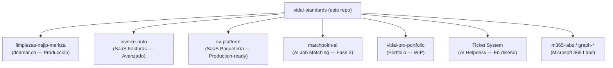
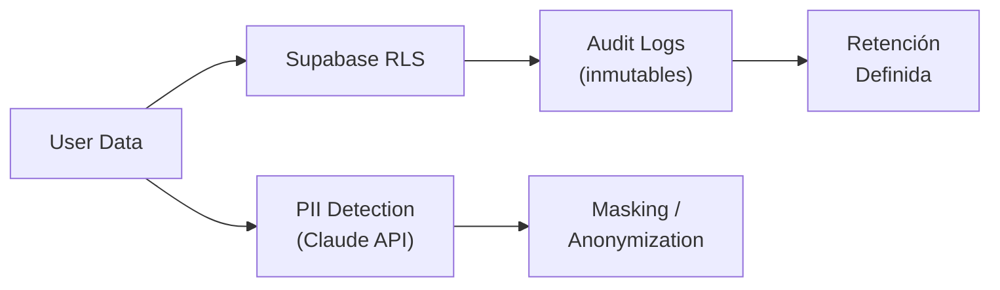

# vidal-standards


> Global engineering standards for the **Vidal Ecosystem** — AI-Powered SaaS Infrastructure targeting Swiss SMEs.

---

## Overview

Este repositorio contiene el estándar maestro que rige todos los proyectos del ecosistema Vidal.  
Cualquier subproyecto nuevo debe adoptar `CLAUDE.md` como contrato de comportamiento con el AI Engineer.

---

## Ecosistema de Proyectos



---

## Stack Global

| Layer | Technology |
|---|---|
| Framework | Next.js 15+ (App Router) |
| Language | TypeScript (strict mode) |
| Database | Supabase (PostgreSQL + RLS) |
| Deployment | Vercel |
| AI | Claude Sonnet 4.6 (Anthropic) |
| Compliance | Swiss DSG / nDSG |

---

## CLAUDE.md — Contrato AI Engineer

El archivo [`CLAUDE.md`](./CLAUDE.md) define el modo operativo del AI Engineer en cada proyecto.

### Comandos activos

| Trigger | Acción |
|---|---|
| `/ghost` | Tono ejecutivo / humano |
| `/uda` | Análisis raíz + arquitectura |
| `/ooda` | Guía técnica paso a paso |
| `L99` | Nivel senior, sin simplificaciones |
| `/godmode` | Profundidad máxima + edge-cases |
| `/audit` | Auditoría de seguridad + vulnerabilidades |

### Reglas de ejecución

1. **Sin relleno** — directo a la solución
2. **Código**: Clean Architecture · Tipado estricto · SOLID
3. **Docs**: Mermaid · Shields.io · ADRs · SEO
4. **Autonomía**: README se actualiza al detectar cambios en APIs o Schema

---

## Compliance Swiss DSG / nDSG



- Logs de auditoría inmutables en todas las operaciones críticas
- Detección de PII antes de persistir datos
- Retención de datos configurada por proyecto
- Sin transferencia de datos fuera de jurisdicción suiza sin consentimiento explícito

---

## Architecture Decision Records (ADRs)

| ADR | Decisión |
|---|---|
| ADR-001 | Next.js App Router como estándar (no Pages Router) |
| ADR-002 | Supabase RLS como capa de autorización primaria |
| ADR-003 | Claude Sonnet 4.6 para features AI en producción |
| ADR-004 | Vercel como plataforma de deployment único |
| ADR-005 | i18n obligatorio (ES/DE/EN) para mercado suizo |

---

## Propagación del Estándar

Al actualizar `CLAUDE.md` en este repo, propagar a todos los subproyectos:

```bash
# Desde la raíz del ecosistema
for dir in cv-platform invoice-auto matchpoint-ai limpiezas-najip-maritza \
           "Ticket System" vidal-pro-portfolio lingualab \
           graph-employee-onboarding hybrid-identity-ticket-automation \
           intune-autopilot-lab m365-enterprise-lab m365-graph-dashboard \
           m365-intune-lab m365-lab profile vidal-renao web-demos website-demos docs; do
  cp vidal-standards/CLAUDE.md "$dir/CLAUDE.md"
done
```

---

*Mantenido por [Vidal Renao](https://github.com/vidalrenao) — Swiss SaaS Engineering*
