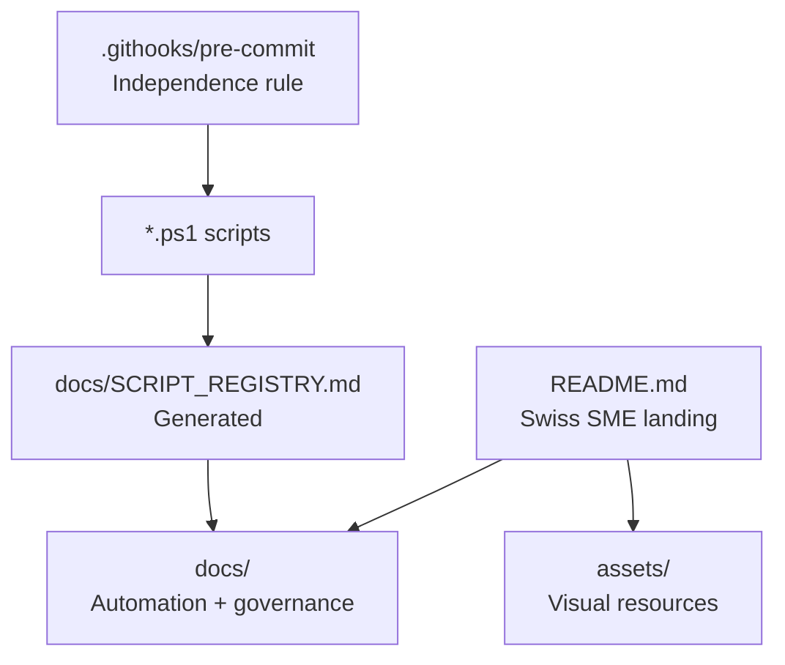

# vidal-standards


**vidal-standards** is the operating standard for the VIDAL ECOSYSTEM: a Swiss SME-ready blueprint for AI-powered SaaS infrastructure, documentation automation, delivery discipline, and compliance-first engineering.

## Business Context

Swiss SMEs need software that is fast to ship, easy to audit, and sober about data protection. This repository defines the minimum technical bar for building **AI-Powered SaaS Infrastructure** in the Swiss market: multilingual UX, strict TypeScript, Supabase RLS, automated documentation, measurable performance, and privacy-by-design workflows aligned with the Swiss DSG/nDSG.

The target outcome is not only code reuse. It is operational trust: every product in the ecosystem should make it clear where personal data lives, which agent or automation touched the system, how deployment is controlled, and how technical decisions can be reviewed by a client, auditor, or engineering partner.

## Architecture Table

| Path | Layer | Purpose | SME Swiss Standard |
|---|---|---|---|
| `/README.md` | Executive landing | Public technical overview, stack badges, architecture, performance, compliance posture | First artifact for client trust and due diligence |
| `/CLAUDE.md` | AI engineering contract | Operating rules, stack defaults, architectural triggers, compliance boundaries | Keeps AI-assisted delivery consistent across projects |
| `/docs` | Automation and governance | PowerShell scripts, agent ecosystem docs, generated script registry | Documentation changes track operational changes automatically |
| `/docs/setup-dev-path.ps1` | Workstation setup | Validates and configures PATH entries for VS Code CLI and GitHub CLI | Reduces onboarding drift on Windows environments |
| `/docs/update-script-registry.ps1` | Documentation automation | Scans repository scripts and regenerates `/docs/SCRIPT_REGISTRY.md` | Enforces the independence rule for script documentation |
| `/docs/agent-ecosystem.md` | AI operating model | Defines Claude Code, GitHub Copilot, Gemini, and Codex responsibilities | Cost-aware multi-agent delivery model capped at USD 40/month |
| `/docs/SCRIPT_REGISTRY.md` | Generated reference | Hashes, size, purpose, and update time for automation scripts | Audit-friendly traceability for script modifications |
| `/assets` | Visual resources | Logos, diagrams, screenshots, and brand assets | Keeps client-facing media separate from code and governance docs |
| `/.githooks/pre-commit` | Git automation | Runs documentation sync before commits | Prevents stale script docs from entering repository history |



## Performance And SEO

Target Lighthouse gates for production-grade VIDAL projects:

| Metric | Target | Notes |
|---|---:|---|
| Performance | 95+ | Server Components, image optimization, route-level code splitting |
| Accessibility | 95+ | Semantic landmarks, keyboard paths, visible focus states |
| Best Practices | 95+ | Security headers, HTTPS-only deployment, dependency hygiene |
| SEO | 95+ | Metadata API, canonical URLs, localized sitemap, structured data |
| First Contentful Paint | < 1.8s | Edge caching and critical CSS discipline |
| Largest Contentful Paint | < 2.5s | Optimized hero media and predictable layout dimensions |
| Cumulative Layout Shift | < 0.05 | Stable dimensions for media, navigation, cards, and dashboards |

Structured data baseline:

```json
{
  "@context": "https://schema.org",
  "@type": "SoftwareApplication",
  "name": "VIDAL AI-Powered SaaS Infrastructure",
  "applicationCategory": "BusinessApplication",
  "operatingSystem": "Web",
  "areaServed": ["CH", "DE", "AT"],
  "inLanguage": ["en", "de", "es"],
  "offers": {
    "@type": "Offer",
    "priceCurrency": "CHF"
  }
}
```

## Swiss DSG Controls

| Control | Standard |
|---|---|
| Data minimization | Collect only fields required for the business workflow |
| Consent | Document explicit consent for external AI processing or cross-border transfer |
| Access control | Supabase RLS is mandatory for user-owned or tenant-owned data |
| Auditability | Critical operations require immutable logs with actor, timestamp, and purpose |
| Retention | Each project documents retention rules in its ADRs or data policy |
| Incident readiness | Secrets, tokens, and webhook payloads must be scoped, rotated, and reviewable |

## Independence Rule

Any modification to script code must update the associated technical documentation without manual intervention. This repository enforces that rule through:

1. `docs/update-script-registry.ps1`, which scans scripts and regenerates `docs/SCRIPT_REGISTRY.md`.
2. `.githooks/pre-commit`, which runs the registry update before Git creates a commit.
3. `git config core.hooksPath .githooks`, which binds the automation to this repository.

Run manually when needed:

```powershell
pwsh -NoProfile -ExecutionPolicy Bypass -File .\docs\update-script-registry.ps1
```

## Agent Operating Model

The full model lives in [`docs/agent-ecosystem.md`](./docs/agent-ecosystem.md). The standard role split is:

| Agent | Role |
|---|---|
| Claude Code | Autonomous implementation and repository navigation |
| GitHub Copilot | Inline suggestion and developer flow acceleration |
| Gemini | Performance, Lighthouse, SEO, and broad comparative analysis |
| Codex | Logic, refactoring, tests, and architectural consistency |

## Local Setup

```powershell
.\docs\setup-dev-path.ps1
git config core.hooksPath .githooks
```

Maintained for VIDAL ECOSYSTEM, Basel, Switzerland.
